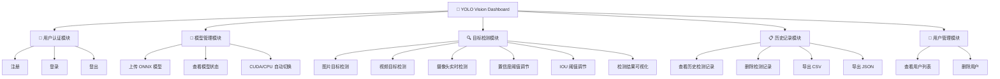
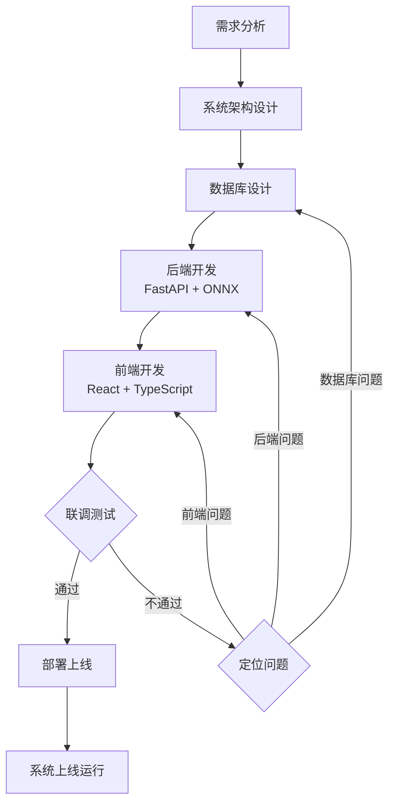
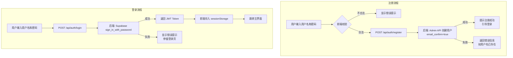
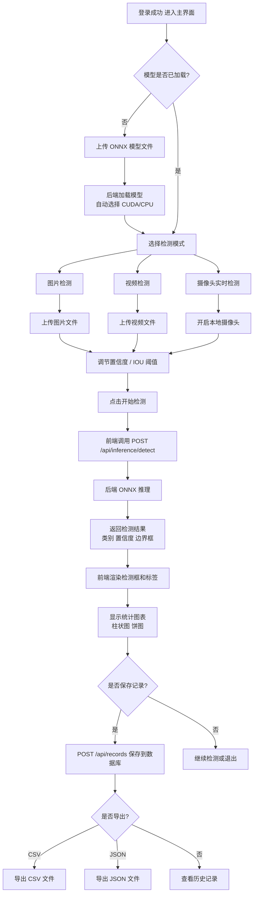

# YOLO Vision Dashboard 系统设计文档

---

## 一、技术栈总览

### 前端技术

| 类别 | 名称 | 版本 | 用途 |
|------|------|------|------|
| 框架 | React | 19.0.0 | UI 组件框架 |
| 语言 | TypeScript | 5.8.2 | 类型安全开发 |
| 构建工具 | Vite | 6.2.0 | 前端构建与开发服务器 |
| 样式 | Tailwind CSS | 4.1.14 | 原子化 CSS 样式 |
| 图标 | Lucide React | 0.546.0 | UI 图标库 |
| 图表 | Recharts | 3.8.1 | 数据可视化图表 |
| 动画 | Motion | 12.23.24 | 动画效果 |
| 推理 | onnxruntime-web | 1.24.3 | 浏览器端 ONNX 推理（备用） |
| AI | @google/genai | 1.29.0 | Google AI 接口 |

### 后端技术

| 类别 | 名称 | 版本 | 用途 |
|------|------|------|------|
| 框架 | FastAPI | 0.115.12 | Python Web API 框架 |
| 服务器 | Uvicorn | 0.34.2 | ASGI 异步服务器 |
| 数据验证 | Pydantic | ≥2.0.0 | 请求/响应数据模型 |
| 推理引擎 | onnxruntime-gpu | ≥1.18.0 | CUDA 加速 ONNX 推理 |
| 图像处理 | OpenCV (headless) | ≥4.8.0 | 图像预处理与视频编码 |
| 图像处理 | Pillow | ≥10.0.0 | 图像格式转换 |
| 数值计算 | NumPy | ≥1.24.0 | 张量运算 |
| 环境变量 | python-dotenv | 1.1.0 | 读取 .env 配置 |
| 文件上传 | python-multipart | 0.0.20 | 多部分表单解析 |

### 数据库与云服务

| 类别 | 名称 | 用途 |
|------|------|------|
| 数据库 | Supabase (PostgreSQL) | 用户数据、检测记录持久化存储 |
| 认证 | Supabase Auth | 用户注册、登录、JWT 令牌管理 |
| 行级安全 | Supabase RLS | 数据隔离，每个用户只能访问自己的数据 |

### 开发工具

| 工具 | 用途 |
|------|------|
| Node.js | 前端运行环境 |
| Python 3.10+ | 后端运行环境 |
| Conda | Python 环境管理（含 CUDA 依赖） |
| NVIDIA CUDA / cuDNN | GPU 加速推理 |
| ONNX 模型格式 | YOLOv8/v11 导出格式 |

---

## 二、系统功能模块图

> **提示词（用于 draw.io / ProcessOn / Mermaid）：**
>
> 绘制一张树形功能模块图，根节点为「YOLO Vision Dashboard」，下分五个一级模块：
> 1. **用户认证模块**：注册、登录、登出
> 2. **模型管理模块**：上传 ONNX 模型、查看模型状态
> 3. **目标检测模块**：图片检测、视频检测、摄像头实时检测、置信度/IOU 阈值调节
> 4. **历史记录模块**：查看检测记录、删除记录、导出 CSV/JSON
> 5. **用户管理模块**（管理员）：查看用户列表、删除用户
> 每个模块用不同颜色区分，使用矩形节点，连接线为直线。



---

## 三、系统用例图

> **提示词（用于 PlantUML / Visio）：**
>
> 绘制 UML 用例图，包含两类参与者：「普通用户」和「管理员」（管理员继承普通用户）。
> 普通用户用例：注册账号、登录系统、上传模型、图片检测、视频检测、实时摄像头检测、查看检测历史、删除自己的记录、导出记录。
> 管理员追加用例：查看所有用户、删除用户。
> 系统边界框标注为「YOLO Vision Dashboard 系统」。

```
参与者：
  - 普通用户
  - 管理员（继承普通用户）

用例列表：
  普通用户：
    UC01 注册账号
    UC02 登录系统
    UC03 登出系统
    UC04 上传 ONNX 模型
    UC05 图片目标检测
    UC06 视频目标检测
    UC07 摄像头实时检测
    UC08 调节检测阈值
    UC09 查看检测历史记录
    UC10 删除检测记录
    UC11 导出检测记录（CSV/JSON）

  管理员（额外）：
    UC12 查看所有用户列表
    UC13 删除指定用户
```

---

## 四、系统开发流程图

> **提示词：**
>
> 绘制软件开发流程图，流程节点依次为：
> 需求分析 → 系统架构设计（前后端分离 + Supabase 云数据库）→ 数据库设计（profiles 表 + detection_records 表）→ 后端开发（FastAPI 路由、JWT 中间件、ONNX 推理引擎）→ 前端开发（React 组件、API 对接、图表可视化）→ 联调测试（CORS、认证、推理接口）→ 部署上线（Conda 环境 + Uvicorn 服务器）。
> 使用竖向流程图，菱形判断节点表示「测试是否通过」，通过则结束，不通过则返回对应开发阶段。



---

## 五、系统注册登录流程图

> **提示词：**
>
> 绘制两张流程图：
> **注册流程**：用户输入用户名密码 → 前端校验（非空、密码≥6位）→ POST /api/auth/register → 后端用 Service Role Key 调用 Supabase Admin API 创建用户（email_confirm=true）→ 返回成功/失败 → 提示用户。
> **登录流程**：用户输入用户名密码 → POST /api/auth/login → 后端调用 Supabase sign_in_with_password → 返回 JWT Token → 前端存入 sessionStorage → 跳转主界面。
> 失败路径：显示错误提示，停留在登录页。



---

## 六、系统操作流程图

> **提示词：**
>
> 绘制用户登录后的主操作流程图：
> 登录成功 → 进入主界面 → 上传 ONNX 模型（若未加载）→ 选择检测模式（图片/视频/摄像头）→ 上传媒体或开启摄像头 → 调节置信度/IOU 阈值 → 点击开始检测 → 系统调用后端推理接口 → 实时渲染检测框和标签 → 显示统计图表 → 可选：保存记录到历史 → 可选：导出记录（CSV/JSON）→ 可选：查看历史记录详情。



---

## 七、数据库结构设计

### 7.1 E-R 图

> **提示词：**
>
> 绘制 E-R 图，包含三个实体：
> 1. **User（用户）**：属性有 id(PK)、email、username、role、created_at
> 2. **Profile（用户档案）**：属性有 id(PK, FK→User)、username、role、created_at
> 3. **DetectionRecord（检测记录）**：属性有 id(PK)、user_id(FK→User)、time、image(base64)、total_detections、fps、avg_confidence、detections(JSON)、video_clips(JSON)、created_at
>
> 关系：User「拥有」Profile（1:1），User「拥有」DetectionRecord（1:N）。
> 用矩形表示实体，椭圆表示属性，菱形表示关系，主键属性下划线标注。

```
实体关系描述：

[User] ----（1:1）---- [Profile]
  |                      |
  | id(PK)               | id(PK, FK→User.id)
  | email                | username
  | username             | role
  | role                 | created_at
  | created_at

[User] ----（1:N）---- [DetectionRecord]
  |                        |
  | id(PK)                 | id(PK)
                           | user_id(FK→User.id)
                           | time
                           | image
                           | total_detections
                           | fps
                           | avg_confidence
                           | detections (JSONB)
                           | video_clips (JSONB)
                           | created_at
```

---

### 7.2 数据库逻辑结构设计（三线表）

**表1：auth.users（Supabase 内置认证用户表）**

| 字段名 | 数据类型 | 约束 | 说明 |
|--------|----------|------|------|
| id | UUID | PRIMARY KEY | 用户唯一标识 |
| email | VARCHAR | NOT NULL, UNIQUE | 虚拟邮箱（username@yolo-vision.com） |
| encrypted_password | TEXT | NOT NULL | 加密存储的密码 |
| email_confirmed_at | TIMESTAMPTZ | | 邮箱确认时间 |
| created_at | TIMESTAMPTZ | NOT NULL | 创建时间 |
| user_metadata | JSONB | | 用户元数据（含 username 字段） |

**表2：public.profiles（用户档案表）**

| 字段名 | 数据类型 | 约束 | 说明 |
|--------|----------|------|------|
| id | UUID | PRIMARY KEY, FK→auth.users.id | 与认证用户一一对应 |
| username | VARCHAR(50) | NOT NULL | 用户名 |
| role | VARCHAR(20) | DEFAULT 'user' | 用户角色（user/admin） |
| created_at | TIMESTAMPTZ | DEFAULT now() | 创建时间 |

**表3：public.detection_records（检测记录表）**

| 字段名 | 数据类型 | 约束 | 说明 |
|--------|----------|------|------|
| id | UUID | PRIMARY KEY, DEFAULT gen_random_uuid() | 记录唯一标识 |
| user_id | UUID | NOT NULL, FK→auth.users.id | 所属用户 |
| time | VARCHAR | NOT NULL | 检测时间（前端格式化字符串） |
| image | TEXT | | Base64 编码的快照图片 |
| total_detections | INTEGER | DEFAULT 0 | 检测目标总数 |
| fps | FLOAT | DEFAULT 0 | 检测帧率 |
| avg_confidence | FLOAT | DEFAULT 0 | 平均置信度 |
| detections | JSONB | DEFAULT '[]' | 检测结果列表（JSON数组） |
| video_clips | JSONB | | 视频片段列表（JSON数组） |
| created_at | TIMESTAMPTZ | DEFAULT now() | 记录创建时间 |

---

### 7.3 数据库表设计详细说明（三线表）

#### detection_records.detections 字段 JSON 结构

| 字段名 | 数据类型 | 说明 |
|--------|----------|------|
| classId | INTEGER | 类别 ID（0-9） |
| className | STRING | 类别名称（如 person、car） |
| score | FLOAT | 置信度（0.0~1.0） |
| box | ARRAY[4] | 边界框 [x1, y1, x2, y2]（像素坐标） |

#### detection_records.video_clips 字段 JSON 结构

| 字段名 | 数据类型 | 说明 |
|--------|----------|------|
| index | INTEGER | 片段序号 |
| start_sec | FLOAT | 片段起始秒数 |
| end_sec | FLOAT | 片段结束秒数 |
| data | STRING | Base64 编码的 MP4 视频数据 |

---

## 八、检测目标类别说明

系统支持以下 10 类交通场景目标检测（对应 YOLO 模型输出）：

| 类别 ID | 类别名称 | 中文说明 |
|---------|----------|----------|
| 0 | person | 行人 |
| 1 | rider | 骑行者 |
| 2 | car | 轿车 |
| 3 | bus | 公交车 |
| 4 | truck | 卡车 |
| 5 | bike | 自行车 |
| 6 | motorcycle | 摩托车 |
| 7 | traffic light | 交通灯 |
| 8 | traffic sign | 交通标志 |
| 9 | train | 火车 |

---

## 九、系统 API 接口总览

| 方法 | 路径 | 认证 | 说明 |
|------|------|------|------|
| POST | /api/auth/register | 否 | 注册新用户 |
| POST | /api/auth/login | 否 | 用户登录，返回 JWT |
| POST | /api/auth/logout | 否 | 登出（客户端清除 token） |
| GET | /api/records | 是 | 获取当前用户检测记录（分页） |
| POST | /api/records | 是 | 保存新检测记录 |
| DELETE | /api/records/{id} | 是 | 删除指定检测记录 |
| GET | /api/users | 是 | 获取所有用户列表 |
| DELETE | /api/users/{id} | 是 | 删除指定用户（管理员） |
| GET | /api/inference/status | 是 | 获取当前模型加载状态 |
| POST | /api/inference/upload-model | 是 | 上传 ONNX 模型文件 |
| POST | /api/inference/detect | 是 | 执行图片目标检测 |
| POST | /api/inference/video-frame | 是 | 提交视频帧（视频检测） |
| POST | /api/inference/video-finalize | 是 | 生成视频检测结果片段 |
| GET | /api/health | 否 | 健康检查 |

---

## 十、系统架构说明

```
┌─────────────────────────────────────────────────────┐
│                    用户浏览器                         │
│  React 19 + TypeScript + Tailwind CSS + Recharts     │
│  ┌─────────┐ ┌──────────┐ ┌──────────┐ ┌─────────┐  │
│  │ 认证界面 │ │ 检测界面  │ │ 历史记录 │ │用户管理 │  │
│  └─────────┘ └──────────┘ └──────────┘ └─────────┘  │
│              Vite Dev Server :3000                   │
└────────────────────┬────────────────────────────────┘
                     │ HTTP (fetch /api/...)
                     │ Vite proxy → :3001
┌────────────────────▼────────────────────────────────┐
│              FastAPI 后端 :3001                       │
│  ┌──────────┐ ┌──────────┐ ┌──────────┐ ┌────────┐  │
│  │ /auth    │ │ /records │ │ /users   │ │/infer  │  │
│  └──────────┘ └──────────┘ └──────────┘ └────────┘  │
│           JWT 中间件 (Supabase 验证)                  │
│           ONNX Runtime GPU 推理引擎                   │
└──────────┬──────────────────────────┬───────────────┘
           │                          │
┌──────────▼──────────┐   ┌──────────▼──────────────┐
│   Supabase Auth      │   │  Supabase PostgreSQL DB  │
│  (用户认证 / JWT)    │   │  profiles 表             │
│                      │   │  detection_records 表    │
└──────────────────────┘   └─────────────────────────┘
```
